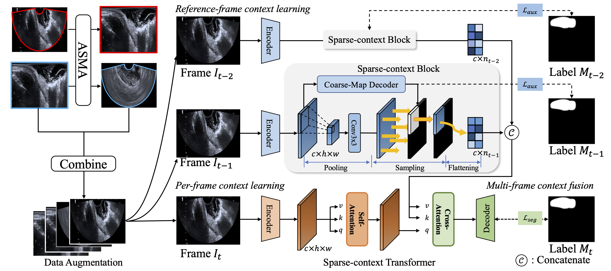

<div align="center">

# UniV: Frequency-Harmonized and Lesion-Aware State Space Learning for Unified Ultrasound Video Segmentation and Diagnosis

</div>

---

## :sparkles: Introduction



**UniV** is a unified end-to-end framework for ultrasound video analysis, jointly performing **frame-level lesion segmentation** and **video-level diagnosis**. The framework introduces:

- **FAMH** (Frequency-Adaptive Mode Harmonization): learnable frequency-domain harmonization that replaces offline scan-mode conversion
- **UATSSM** (Ultrasound-Aware Temporal State Space Model): PyTorch-compatible temporal modeling tailored for ultrasound video characteristics
- **LATA** (Lesion-Aware Temporal Aggregation): adaptive video-level feature aggregation with lesion-aware weighting
- **CTSI** (Cross-Task Synergy Integration): bidirectional information flow between segmentation and diagnosis tasks with video-level consistency

The default code path uses `Data/ERUS/video_labels.txt` for 5-way T-stage supervision and geometry-based pseudo labels for scan mode.

## :mag: Prerequisites

### Clone repository

```shell
# clone project
git clone https://github.com/yuncheng97/UniV.git
cd UniV/

# create conda environment and install dependencies
conda env create -f environment.yaml
conda activate UniV
```

### Datasets

UniV is evaluated on **4 publicly available ultrasound video datasets**:

| Dataset | Task | Link |
|---------|------|------|
| **ERUS** | Colorectal cancer segmentation & T-stage classification | [GitHub](https://github.com/yuncheng97/ASTR) |
| **JNU-IFM** | Thyroid nodule segmentation | [Figshare](https://figshare.com/articles/dataset/JNU-IFM/14371652) |
| **ThyroidCineClip** | Thyroid nodule classification | [Stanford AIMI](https://aimi.stanford.edu/datasets/thyroid-ultrasound-cine-clip) |
| **EchoCP** | Echocardiography segmentation | [GitHub](https://github.com/XiaoweiXu/EchoCP-An-Echocardiography-Dataset-in-Contrast-Transthoracic-Echocardiography-for-PFO-diagnosis/blob/main/README.md) |

After downloading the datasets, place them in the `data/` directory:

```shell
mkdir data/
# Place downloaded datasets here
```

### Download pretrained backbone

Download the pretrained backbone weights and place them in the `pretrained/` directory. You can then train the model on ERUS-10K or your own dataset from scratch.

<!-- - [Res2Net50](https://drive.google.com/file/d/1RzSdIGhM6kR7yJQWHWy8ed7WNhGrt-m3/view?usp=sharing)
- [PVT_v2_b2](https://drive.google.com/file/d/1I8uPAEzKuI311V_HJpQ7Ppf-LDgi7K_O/view?usp=sharing) -->
- [DINOv3](https://huggingface.co/docs/transformers/model_doc/dinov3)
```shell
mkdir pretrained/
# Place downloaded weights here
```

<!-- ### Download pretrained model (optional)

You can also download our [pretrained model checkpoint](https://drive.google.com/file/d/1hM7vZuKroNqbO0gaZiQVAP4xcSLXTjHW/view?usp=sharing) on ERUS-10K for evaluation. -->

---


## :rocket: Training and Evaluation

Set your own training configuration before training.

### Recommended shell entrypoint

```shell
bash scripts/train.sh
```

Useful environment overrides:

```shell
DATA_ROOT=../Data/ERUS \
OUTPUT_ROOT=./results \
BACKBONE=res2net50 \
TRAIN_SIZE=352 \
CLIP_SIZE=3 \
BATCH_SIZE=2 \
EPOCHS=20 \
GPU_ID=0 \
NOTE=univ_run \
bash scripts/train.sh
```

### Training on single node

```shell
python train.py \
    --gpu_id 0 \
    --batchsize 2 \
    --lr 0.0001 \
    --data_root ../Data/ERUS \
    --train_size 352 \
    --clip_size 3 \
    --backbone res2net50 \
    --scheduler cos \
    --optimizer adamw \
    --epoch 20 \
    --use_mode_pseudo_labels \
    --eval_split val \
    --note univ_run
```

### Minimal smoke test

```shell
python train.py \
    --gpu_id 0 \
    --data_root ../Data/ERUS \
    --backbone res2net50 \
    --train_size 64 \
    --clip_size 3 \
    --batchsize 1 \
    --epoch 1 \
    --num_workers 0 \
    --limit_train_batches 2 \
    --limit_val_batches 1 \
    --use_mode_pseudo_labels \
    --note smoke
```

### Evaluation

```shell
python eval.py \
    --gpu_id 0 \
    --data_root ../Data/ERUS \
    --train_size 352 \
    --clip_size 3 \
    --resume ./results/univ_run/log_xxx \
    --eval_split test \
    --task both \
    --use_mode_pseudo_labels
```

## :pray: Acknowledgement

This repository is built upon [FLA-Net](https://github.com/jhl-Det/FLA-Net) and [segmentation_models_pytorch](https://github.com/qubvel-org/segmentation_models.pytorch). We thank the authors for their valuable contributions.

<!-- ## :book: Citation

If you find this work helpful, please cite our paper:

```bibtex
@article{jiang2024towards,
  title={Towards a Benchmark for Colorectal Cancer Segmentation in Endorectal Ultrasound Videos: Dataset and Model Development},
  author={Jiang, Yuncheng and Hu, Yiwen and Zhang, Zixun and Wei, Jun and Feng, Chun-Mei and Tang, Xuemei and Wan, Xiang and Liu, Yong and Cui, Shuguang and Li, Zhen},
  journal={arXiv preprint arXiv:2408.10067},
  year={2024}
}
``` -->

## :page_facing_up: License

This project is licensed under the [MIT License](LICENSE).

